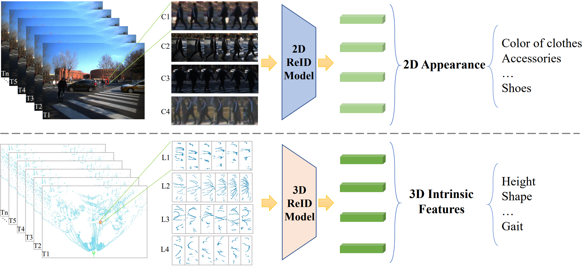

# LiDAR-based Person Re-identification
Code for LiDAR-based Person Re-identification. The dataset LReID will be released soon.

### [Paper](https://arxiv.org/abs/2312.03033) | [Project Page](https://github.com/GWxuan/ReID3D)

## Introduction
Camera-based person re-identification (ReID) systems have been widely applied in the field of public security. However, cameras often lack the perception of 3D morphological information of human and are susceptible to various limitations, such as inadequate illumination, complex background, and personal privacy. In this paper, we propose a LiDAR-based ReID framework, ReID3D, that utilizes pre-training strategy to retrieve features of 3D body shape and introduces Graph-based Complementary Enhancement Encoder for extracting comprehensive features. Due to the lack of LiDAR datasets, we build LReID, the first LiDAR-based person ReID dataset, which is collected in several outdoor scenes with variations in natural conditions. Additionally, we introduce LReID-sync, a simulated pedestrian dataset designed for pre-training encoders with tasks of point cloud completion and shape parameter learning. Extensive experiments on LReID show that ReID3D achieves exceptional performance with a rank-1 accuracy of 94.0, highlighting the significant potential of LiDAR in addressing person ReID tasks. To the best of our knowledge, we are the first to propose a solution for LiDAR-based ReID.

## Data

## Data Acquisition Scenes

## Method
Pre-training:

ReID network:

   
